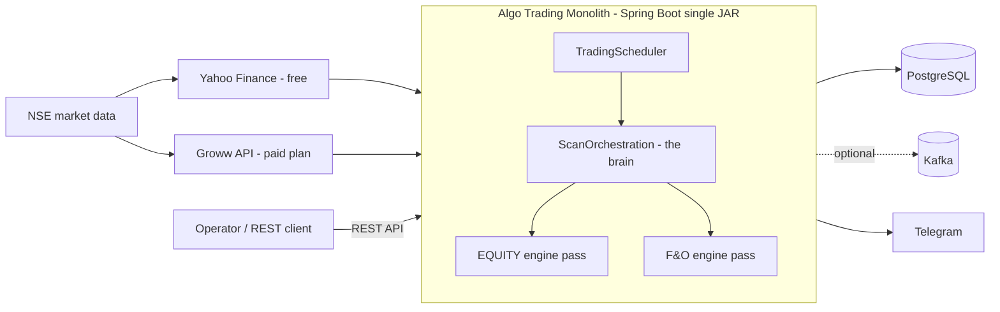
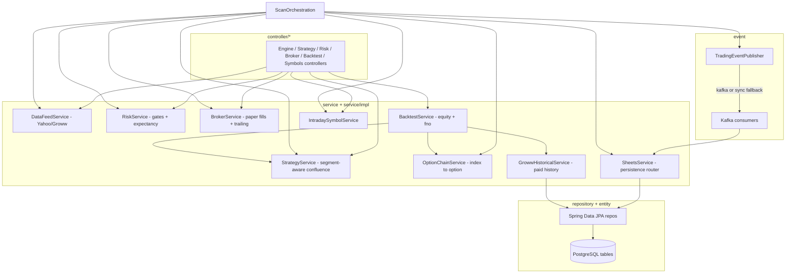
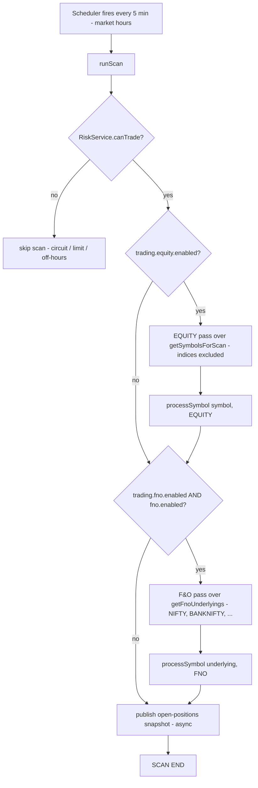
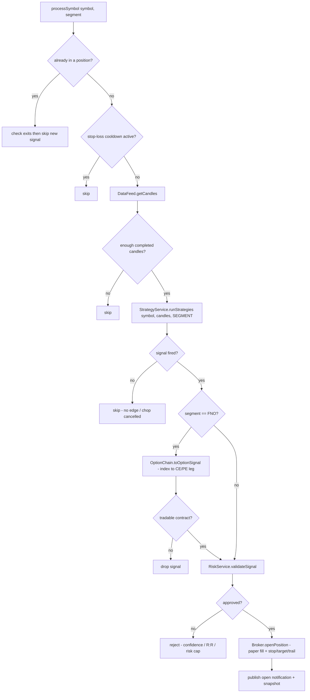
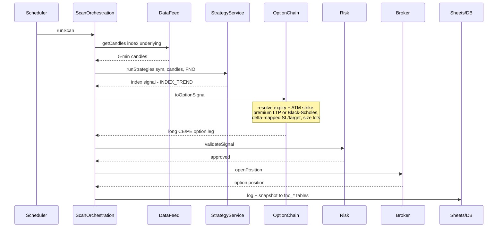
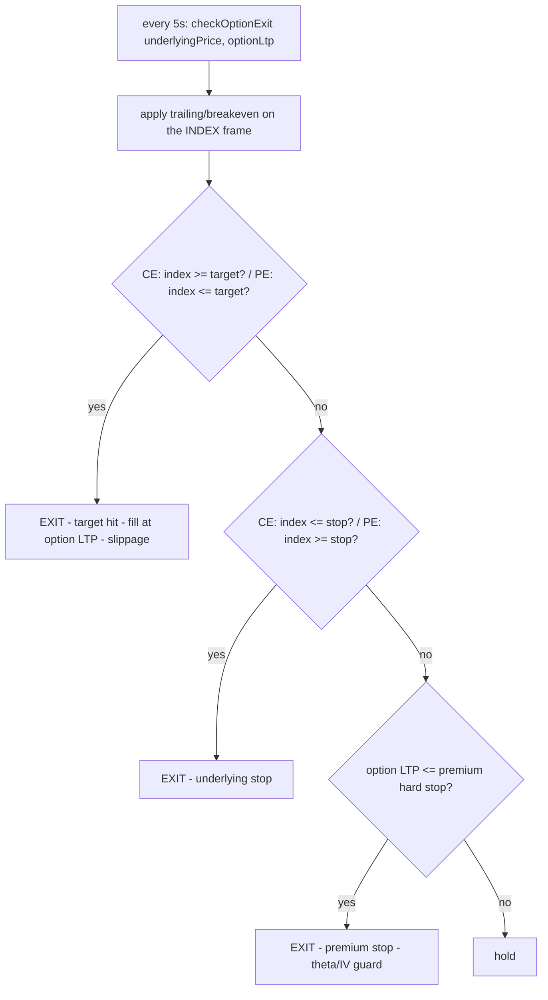
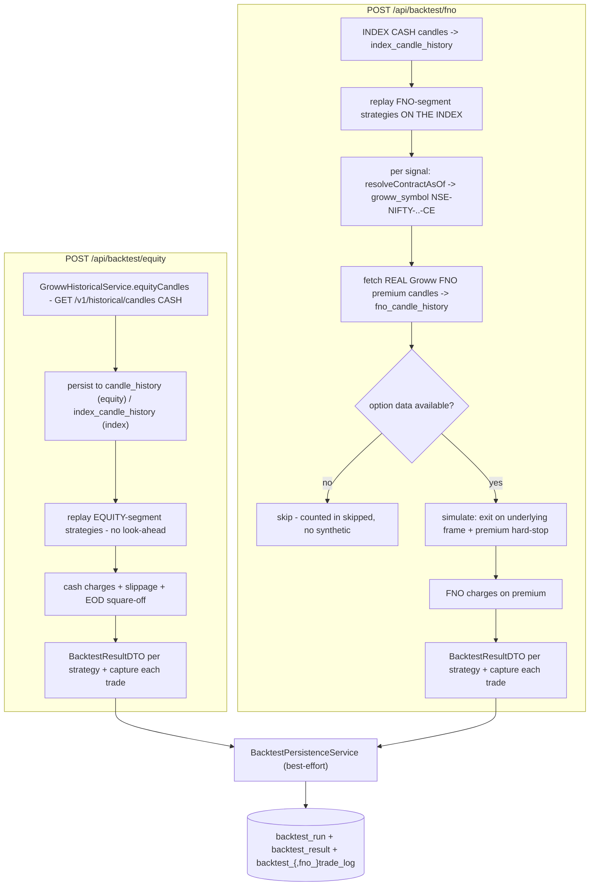

# System Design — Algo Trading Monolith

> NSE intraday **F&O (index options) + equity** paper-trading system. Single-JAR Spring Boot monolith.
> **Educational / paper only — no real orders are ever placed.**
>
> This document describes the full system structure and the recent changes
> (parallel equity + F&O engines, per-segment strategies, separated F&O tables,
> and Groww-historical backtesting). For day-to-day agent guidance see `CLAUDE.md`;
> this file is the deeper architectural reference.

---

## 1. Purpose & scope

The system scans a set of NSE symbols during market hours (IST), runs technical
strategies, validates signals against risk rules, and opens/closes **simulated**
("paper") positions through a fake broker. Everything is persisted to PostgreSQL.

Two instruments are traded, by two independent engines that run every scan:

| Engine | Instrument | Symbols | Order tables |
|--------|-----------|---------|--------------|
| **EQUITY** | intraday cash equity | equity tickers (`intraday_symbol` / `app.symbols`) | `open_position`, `trade_log` |
| **F&O** | index **options** (long CE/PE) | configured indices (NIFTY, BANKNIFTY, FINNIFTY, MIDCPNIFTY) | `fno_open_position`, `fno_trade_log` |

Each engine has its **own strategy set** (via `strategy_config.segment`), its **own
symbols**, its **own order tables**, and its **own on/off switch** in `application.yml`.

---

## 1A. High-Level Design (HLD), Flows & Diagrams

> Two formats below: **ASCII box-and-arrow diagrams** (§1A.0 — render as pictures in
> ANY viewer, including plain text) and the same diagrams in **Mermaid** (§1A.1+ —
> render graphically on GitHub / Mermaid-enabled IDEs).

### 1A.0 Architecture at a glance (ASCII box + arrow)

**A. System architecture / context**

```text
                        +-----------------------------+
                        |       NSE market data       |
                        +--------------+--------------+
                     +-----------------+-----------------+
                     v                                   v
            +------------------+                +------------------+
            |  Yahoo Finance   |                |    Groww API     |
            |     (free)       |                |   (paid plan)    |
            +--------+---------+                +---------+--------+
                     |            candles / LTP           |
                     +------------------+-----------------+
                                        v
 +---------------+          +---------------------------------------------+
 |  Operator /   |   REST   |          ALGO TRADING MONOLITH              |
 |  REST client  |--------->|          (Spring Boot single JAR)           |
 +---------------+          |                                             |
                            |   +-------------------------------------+   |
                            |   |  TradingScheduler (cron / 5-min)    |   |
                            |   +------------------+------------------+   |
                            |                      v                      |
                            |   +-------------------------------------+   |
                            |   |  ScanOrchestration  (the brain)     |   |
                            |   |    +-- EQUITY engine pass           |   |
                            |   |    +-- F&O engine pass              |   |
                            |   +-------------------------------------+   |
                            +------+-----------------+----------------+---+
                                   v                 v                v
                          +---------------+   +-----------+   +-------------+
                          |  PostgreSQL   |   |   Kafka   |   |  Telegram   |
                          |   (Flyway)    |   | (optional)|   |   alerts    |
                          +---------------+   +-----------+   +-------------+
```

**B. Layered architecture (dependency flows downward)**

```text
   +--------------------------------------------------------------+
   |  controller/        REST endpoints (thin)                    |
   +-------------------------------+------------------------------+
                                   | calls
                                   v
   +--------------------------------------------------------------+
   |  service/           interfaces                               |
   |  service/impl/      business logic                           |
   |     DataFeed | Strategy | OptionChain | Risk | Broker |      |
   |     Backtest | GrowwHistorical | Sheets | Symbols           |
   +----------------+---------------------------+-----------------+
                    | persist                   | async work
                    v                           v
        +----------------------+     +-----------------------------+
        |  repository/ (JPA)   |     |  event/ TradingEventPublisher|
        +----------+-----------+     +--------------+--------------+
                   v                                | kafka OR sync
        +----------------------+                    v
        |  entity/  DB tables  |     +-----------------------------+
        +----------------------+     |  consumers ->               |
                                     |  Sheets / Notify / Candle   |
                                     +-----------------------------+
```

**C. Live scan — two parallel engine passes**

```text
    +----------------------+
    | Scheduler every 5min |
    +----------+-----------+
               v
        +--------------+   no
        |  canTrade?   |--------> skip scan (circuit / limit / off-hours)
        +------+-------+
               | yes
               v
   +----------------------------------+
   |  EQUITY PASS                     |   gate: trading.equity.enabled
   |  symbols = equity shortlist      |   (index symbols excluded)
   |  strategies = EQUITY segment     |
   |  --> open_position / trade_log   |
   +----------------+-----------------+
                    v
   +----------------------------------+
   |  F&O PASS                        |   gate: trading.fno.enabled
   |  symbols = index underlyings     |         AND fno.enabled
   |  strategies = FNO segment        |
   |  signal --> CE/PE option leg     |
   |  --> fno_open_position /         |
   |      fno_trade_log               |
   +----------------+-----------------+
                    v
          +--------------------+
          | publish snapshot   |
          +--------------------+
```

**D. Per-symbol pipeline (processSymbol)**

```text
  +----------+     +-------------------+     +--------------------+     +--------+     +-----------+     +---------+
  | DataFeed |---->| Strategy(segment) |---->| OptionChain        |---->|  Risk  |---->|  Broker   |---->| Events  |
  |  candles |     | confluence signal |     | (FNO pass only):   |     |  gate  |     | paper fill|     | log/    |
  |          |     |                   |     | index -> CE/PE leg |     |        |     | + trailing|     | notify  |
  +----------+     +-------------------+     +--------------------+     +--------+     +-----------+     +---------+
       |                                            (equity pass skips this box)
       +-- Yahoo / Groww (5-min OHLCV)
```

**E. F&O option exit (checked every 5s — decided on the UNDERLYING, filled on premium)**

```text
   +----------------------------+
   | apply trailing on INDEX    |
   +-------------+--------------+
                 v
        +--------------------+  yes
        | index hit TARGET?  |--------> EXIT: fill at option LTP - slippage
        +--------+-----------+
                 | no
                 v
        +--------------------+  yes
        | index hit STOP?    |--------> EXIT: underlying stop
        +--------+-----------+
                 | no
                 v
        +----------------------------+  yes
        | premium <= hard-stop?      |--------> EXIT: theta / IV guard
        +--------+-------------------+
                 | no
                 v
              [ hold ]
```

**F. Backtest (after-hours) — split by segment, Groww historical**

```text
  POST /api/backtest/equity                   POST /api/backtest/fno
  +-----------------------------+             +-----------------------------------+
  | Groww CASH candles (wide)   |             | underlying CASH candles (wide)    |
  +--------------+--------------+             +-----------------+-----------------+
                 v                                              v
  | persist -> candle_history   |             | replay FNO-segment strategies     |
                 v                                              v
  | replay EQUITY-seg strategies|             | per signal: resolveContractAsOf   |
                 v                                              v
  | cash charges + slippage +   |             | fetch REAL Groww FNO premium      |
  | EOD square-off              |             | candles (entry day)               |
                 v                                              v
  | BacktestResultDTO/strategy  |             |  data? --no--> skip (counted)     |
  +-----------------------------+             |    |yes                           |
                                              |    v                              |
                                              | simulate: exit on underlying +    |
                                              | premium hard-stop; FNO charges    |
                                              +-----------------+-----------------+
                                                                v
                                              |  BacktestResultDTO/strategy       |
```

---

### 1A.1 System context (HLD) — Mermaid

How the monolith sits between market-data providers, storage, and operators.



### 1A.2 Component / container view (HLD)

Layered components and the async event path.



### 1A.3 Live scan flow — two parallel engine passes



### 1A.4 processSymbol decision flow (per symbol, per segment)



### 1A.5 F&O pass sequence (index signal → option order)



### 1A.6 Option exit (decided on the underlying frame)



### 1A.7 Backtest flow (after-hours, split by segment)



### 1A.8 Data model (ER) — separated equity vs F&O

No foreign keys (paper system); `POS-nnnnn` links a position to its closed trade
logically. Equity and F&O each get an open (live snapshot) + trade-log (history) pair.

```mermaid
erDiagram
  strategy_config {
    string strategy PK
    boolean enabled
    string segment "EQUITY | FNO | BOTH"
  }
  intraday_symbol {
    bigint id PK
    string symbol
    boolean active
  }
  open_position {
    bigint id PK
    string position_id "POS-n"
    string symbol
    string strategy
    double entry_price
  }
  trade_log {
    bigint id PK
    string position_id "POS-n"
    string symbol
    string strategy
    double pnl
  }
  fno_open_position {
    bigint id PK
    string position_id "POS-n"
    string underlying
    string option_type "CE | PE"
    double strike
  }
  fno_trade_log {
    bigint id PK
    string position_id "POS-n"
    string underlying
    string option_type
    double pnl
  }
  candle_history {
    bigint id PK
    string symbol "equity"
    timestamp ts
    double close
  }
  index_candle_history {
    bigint id PK
    string symbol "canonical index"
    timestamp ts
    double close
  }
  fno_candle_history {
    bigint id PK
    string symbol "option groww_symbol"
    timestamp ts
    double close
  }
  daily_summary {
    bigint id PK
    string summary_date
    double total_pnl
  }
  backtest_run {
    bigint id PK
    string mode "EQUITY | FNO"
    string symbols
    int window_days
    double net_pnl
  }
  backtest_result {
    bigint id PK
    bigint run_id FK
    string strategy
    double avg_r
  }
  backtest_trade_log {
    bigint id PK
    bigint run_id FK
    string symbol
    string exit_reason
    double pnl
  }
  backtest_fno_trade_log {
    bigint id PK
    bigint run_id FK
    string symbol "option groww_symbol"
    string exit_reason
    double pnl
  }
  open_position ||..|| trade_log : "same POS-n when closed"
  fno_open_position ||..|| fno_trade_log : "same POS-n when closed"
  strategy_config ||--o{ trade_log : "strategy runs -> equity trades"
  strategy_config ||--o{ fno_trade_log : "strategy runs -> F&O trades"
  backtest_run ||--o{ backtest_result : "one run -> per-strategy results"
  backtest_run ||--o{ backtest_trade_log : "one run -> equity trades"
  backtest_run ||--o{ backtest_fno_trade_log : "one run -> F&O trades"
```



---

## 2. Tech stack

- **Java 8** (`1.8` source/target — no Java 9+ APIs: no `var`, `List.of`, records, switch expressions).
- **Spring Boot 2.7.18** — Web, Actuator, Scheduling, Data JPA, Kafka.
- **PostgreSQL** + **Flyway** migrations + Hibernate (`ddl-auto: validate` — schema is owned by Flyway).
- **Kafka** — optional, gated by `app.kafka.enabled`; a synchronous fallback path exists.
- **Lombok** — `@RequiredArgsConstructor`, `@Slf4j`, `@Data`, `@Builder`.
- **Maven** — group `com.algotrading`, artifact `algo-trading-monolith`, v1.0.0.

---

## 3. Layering & package structure

Strict **interface + impl** split. Every service is an interface in `service/` with a
single implementation in `service/impl/`. Constructor injection via Lombok
`@RequiredArgsConstructor` (no field `@Autowired`).

```
controller/   REST endpoints (thin)
  ↓
service/      interfaces
service/impl/ implementations (business logic)
  ↓
repository/   Spring Data JPA
  ↓
entity/       JPA rows

dto/          wire objects (controllers, cross-service)
model/        internal mutable state (TradeCharges, OptionContract, DailyStats, Order)
enums/        StrategyType, Segment, SignalType, InstrumentType, OptionType, ...
util/         pure helpers (Indicator, OptionPricing, Symbols)
config/       AppConfig, KafkaConfig, FnoProperties
event/        Kafka publisher + consumers (+ sync fallback)
scheduler/    TradingScheduler (cron / fixed-rate triggers)
```

Dependency direction is strictly downward: `controller → service (iface) → impl →
repository → entity`. DTOs cross the wire; entities are JPA-only; models are internal.

---

## 4. Core live flow (the important path)

`TradingScheduler` fires `ScanOrchestrationServiceImpl.runScan()` every 5 minutes
during market hours. **runScan now executes two engine passes**, each gated by config:

```
runScan()
├─ system risk gate ....................... RiskService.canTrade()
│
├─ if trading.equity.enabled:
│    runEnginePass( getSymbolsForScan(),  EQUITY )
│      └─ per equity symbol → processSymbol(symbol, EQUITY)
│
└─ if trading.fno.enabled && fno.enabled:
     runEnginePass( getFnoUnderlyings(),  FNO )
       └─ per index underlying → processSymbol(symbol, FNO)
```

### processSymbol(symbol, segment)

```
1. Already in a position for symbol?  → check exits, skip new signal
2. Stop-loss cooldown active?         → skip  (risk.stop-cooldown-min)
3. DataFeedService.getCandles()       → fetch 5-min candles (Groww / Yahoo)
4. StrategyService.runStrategies(symbol, candles, SEGMENT)
                                       → confluence-aware signal (this segment only)
5. if segment == FNO:                 → OptionChainService.toOptionSignal()
                                          (index signal → ATM CE/PE leg)
6. RiskService.validateSignal()       → min-confidence / min-R:R / risk cap
7. BrokerService.openPosition()       → simulated fill (slippage), stop/target/trail
8. publish open-notification + open-positions refresh (async via Kafka)
```

Non-critical work (trade logging, candle ingest, Telegram alerts) is emitted through
`TradingEventPublisher`, which publishes to Kafka **or** falls back to a direct
service call when Kafka is disabled.

```
CRITICAL (sync):  DataFeed → Strategy → [OptionChain] → Risk → Broker
NON-CRITICAL:     TradingEventPublisher → { SheetsService(DB), NotificationService(Telegram), CandleHistory }
```

### Why two passes and not threads

The two passes run **sequentially** within one scan. The paper broker, risk stats,
and position-id counter are shared in-memory state; sequential passes avoid locking
and race conditions at negligible cost (5-minute cadence). This was a deliberate
design choice over true multi-threading.

---

## 5. Scheduler timings (IST, `Asia/Kolkata`)

| Job | When | Method |
|-----|------|--------|
| Exit checks (SL/target on open positions) | every 5s, market hours | `scheduledExitCheck` |
| Market scan (both engine passes) | every 5 min, 09:15–15:25 | `scheduledScan` |
| EOD square-off | 15:26 Mon–Fri | `scheduledEod` |
| Auto shutdown (optional) | 15:27 Mon–Fri | `scheduledShutdown` |
| Symbol shortlist refresh | every 30 min | `IntradaySymbolService` |
| Health check | every 15 min | `HealthService` |

File: `scheduler/TradingScheduler.java`. All times IST; market 09:15–15:25.

**Consequence for F&O:** paper positions are squared off at EOD, so every F&O trade
is **intraday** (entry and exit on the same day). This simplifies option handling —
no overnight theta/expiry roll to model in the live flow or backtest.

---

## 6. Strategies & the segment model

Strategies implement `service/TradingStrategy` (`generate`, `getType`, `minCandles`)
and are `@Component` beans auto-injected into `StrategyServiceImpl`.

### Live strategy set

| StrategyType | File | Default segment | Setup |
|---|---|---|---|
| `VWAP_TREND`   | `VwapTrendStrategy`   | EQUITY | pullback to rising VWAP, 2.5R, RSI exhaustion guard |
| `EMA_PULLBACK` | `EmaPullbackStrategy` | EQUITY | stacked EMA9/21/50, buy pullback to EMA21, 2.5R |
| `ORB_REFINED`  | `OrbRefinedStrategy`  | EQUITY | opening-range breakout in gap/bias direction, 2R |
| `INDEX_TREND`  | `IndexTrendStrategy`  | FNO    | volume-free index momentum: ADX≥20 + Supertrend + EMA + VWAP alignment, 2.2R |

Legacy negative-expectancy strategies (ORB, ORB_RETEST, VWAP_MR, EMA_CROSS,
SUPERTREND, GAP_GO) were deleted in V11.

### Which strategy runs where — `strategy_config.segment`

`strategy_config` is the source of truth for **which** strategies run and in **which
engine**:

```
strategy_config
  strategy      | enabled | segment
  VWAP_TREND    | true    | EQUITY
  EMA_PULLBACK  | true    | EQUITY
  ORB_REFINED   | true    | EQUITY
  INDEX_TREND   | true    | FNO
```

`Segment` = `EQUITY | FNO | BOTH`. A `BOTH` strategy runs in both passes. Loaded once
into memory at startup, toggled at runtime via the API (no restart).

- `StrategyService.runStrategies(symbol, candles, Segment)` — runs only the enabled
  strategies whose segment matches the pass.
- `StrategyService.strategiesForSegment(Segment)` — the per-segment set the backtest uses.

### Confluence runner

Within a pass, **all** matching strategies run:
- opposite-direction signals **cancel** (disagreement = chop → stay flat);
- 2+ agreeing = highest-confidence signal with a `+0.05`/extra-vote bonus (cap 0.95);
- a single signal passes through unchanged.

Indicator math is pure static (no state): `util/Indicator.java` — EMA, RSI, ATR,
VWAP, rolling stddev, MACD, Supertrend, ADX.

> **Index candles report ZERO volume** on NSE — never hard-gate an index strategy on
> volume; make the volume confirm neutral when `rollingAvgVolume <= 0`.

---

## 7. F&O (index options) conversion

When the F&O pass produces an index signal, `OptionChainService` converts it to a
**long option** paper order:

```
BUY index  → buy CE   |   SELL index → buy PE     (always long; no writing / margin model)
```

Resolution (`GrowwOptionChainServiceImpl`):
1. **Expiry** — nearest weekly/monthly expiry on/after today (per `fno.underlyings`).
2. **Strike** — ATM ± `itm-offset-steps`, snapped to the underlying's `strike-step`.
3. **Trading symbol** — NSE format (`NIFTY2570824500CE` weekly / `NIFTY25JUL24500CE` monthly).
4. **Premium** — Groww FNO LTP, with a **Black-Scholes synthetic fallback** (`util/OptionPricing`).
5. **SL/target** — underlying-frame distances mapped into premium terms via delta; a
   premium **hard-stop** guards theta/IV bleed.
6. **Sizing** — lots sized to `fno.risk-per-trade-pct` of capital, clamped by
   `max-lots`, `max-premium`, and a hard risk cap.

**Exits run on the underlying index frame** (faithful to the strategy), filled at the
option premium — see `PaperBrokerServiceImpl.checkOptionExit`: CE is long-frame (profits
when the index rises), PE short-frame; breakeven+trailing are computed on the index;
the premium hard-stop is a separate guard.

Reusable resolution (shared by live flow and backtest):
- `OptionChainService.resolveContractAsOf(scanSymbol, direction, spot, asOf)` — the
  contract a signal would trade as-of any instant (used by the backtest for historical bars).
- `OptionChainService.sizeOptionLots(premium, premiumStop, lotSize)` — shared sizing.

F&O tunables live in `application.yml` (`fno:` block) — lot sizes, strike steps,
expiry days, risk caps. NSE revises these by circular; **update config, not code.**

---

## 8. Risk management

`RiskServiceImpl` gates every signal and the system as a whole:
- **System gate** (`canTrade`): daily-loss circuit breaker, max-trades/day, daily
  profit target, market-hours window.
- **Signal gate** (`validateSignal`): min confidence, min R:R, per-trade risk cap
  (equity ~1%; **option positions get a higher cap**, `fno.max-risk-per-trade-pct`).
- **Per-strategy expectancy** (`GET /api/risk/expectancy?days=N`) — realized win-rate,
  avg P&L, avg R per strategy, to kill negative-edge strategies.

**Both engines feed one risk view.** Because F&O trades are stored in a separate
table, the risk service explicitly aggregates **both** `trade_log` and `fno_trade_log`
for the daily-loss restore and the expectancy report. Live P&L during the day is
tracked in-memory via `recordTrade(pnl)` (called for equity and F&O closes alike).

Tunables: `risk:` block in `application.yml` (source of truth).

---

## 9. Persistence model

Flyway owns the schema (`db/migration/V1..V16`). **Never edit an applied migration —
add a new `V17__*.sql`.** Entity columns must match the SQL exactly or `ddl-auto: validate`
fails at boot. On Neon, Flyway runs over the DIRECT (non-pooler) endpoint
(`spring.flyway.url`) because session advisory locks break on PgBouncer.

### Tables

| Table | Holds | Written by |
|-------|-------|------------|
| `trade_log` | closed **equity** trades | `PostgresSheetsServiceImpl` |
| `open_position` | live **equity** positions (snapshot, refreshed each scan) | `PostgresSheetsServiceImpl` |
| `fno_trade_log` | closed **F&O** trades | `PostgresSheetsServiceImpl` |
| `fno_open_position` | live **F&O** legs (snapshot) | `PostgresSheetsServiceImpl` |
| `daily_summary` | one row per trading day | `RiskService` / sheets |
| `strategy_config` | per-strategy `enabled` + `segment` | strategy toggle API / migrations |
| `intraday_symbol` | equity scan shortlist (refreshed every 30 min) | external updater API |
| `candle_history` | stored 5-min **equity** CASH OHLCV (unique on symbol+ts) | candle ingest + backtest fetch |
| `index_candle_history` | stored 5-min **index underlying** CASH OHLCV (unique on symbol+ts) | index candle ingest + backtest fetch |
| `fno_candle_history` | stored 5-min **option premium** OHLCV (unique on symbol+ts) | F&O candle ingest + F&O backtest fetch |
| `backtest_run` | one row per `/api/backtest/{equity,fno}` run (header + aggregate totals) | `BacktestPersistenceService` |
| `backtest_result` | per-strategy summary of a run (= the JSON `data[]` rows) | `BacktestPersistenceService` |
| `backtest_trade_log` | every simulated **equity** backtest trade | `BacktestPersistenceService` |
| `backtest_fno_trade_log` | every simulated **F&O** backtest trade | `BacktestPersistenceService` |
| `health_check_log` | health pings | health service |

### F&O table routing

`PostgresSheetsServiceImpl` routes by `PositionDTO.isOption()`:
- `logTrade` → `fno_trade_log` for options, `trade_log` for equity.
- `updateOpenPositions` → clears **both** snapshot tables, writes each position to its table.
- `loadOpenPositions` → reads and **merges** both tables.

The F&O entities (`FnoOpenPositionEntity`, `FnoTradeLogEntity`) mirror the equity ones
(including the V11 option-contract + underlying-frame + trail columns).

### Shared position-id sequence

Positions use one shared `POS-nnnnn` sequence across both engines. On restart the
broker seeds its counter from `max(trade_log, fno_trade_log)` position numbers so ids
never collide.

---

## 10. Data feed

`DataFeedService` is provider-abstract:

- **`YahooFinanceDataFeedServiceImpl`** (default, free) — browser UA required (Yahoo
  429s Java's default UA); indices map to `^NSEI` / `^NSEBANK` / …; equities get `.NS`.
- **`GrowFinanceDataFeedServiceImpl`** (Groww) — needs Groww's **paid** data plan
  (free-plan tokens 403 on all market-data endpoints). Selected by
  `app.datafeed.provider: groww`.

`GrowwAuthServiceImpl` handles the daily token exchange (SHA256 checksum flow) and
throttled authenticated GETs; it is shared by the feed **and** the option chain.

**Historical candles use Groww's current `/v1/historical/candles` endpoint** —
`groww_symbol` (dash-joined: `NSE-RELIANCE`, `NSE-NIFTY-08Jul25-24500-CE`),
`candle_interval` (`5minute`), and `start_time`/`end_time` in **epoch seconds**. The
deprecated `/v1/historical/candle/range` (`trading_symbol` + `interval_in_minutes` +
epoch millis) is no longer used. groww_symbols are built by `Symbols.growwCashSymbol` /
`Symbols.growwOptionSymbol`. LTP stays on `/v1/live-data/ltp` with underscore-joined
`exchange_symbols` (`NSE_RELIANCE`).

### Candle persistence — 3-way split, routed by symbol type (live AND backtest)

Candle OHLCV is persisted through the **event publisher**, never a direct blocking DB
write in the hot path. `TradingEventPublisher.publishCandles` **routes by symbol type** —
so live-feed fetches and backtest-historical fetches land in the right store automatically,
with no caller changes:

| Candle type | Topic | Consumer → service | Table |
|-------------|-------|--------------------|-------|
| **Equity** (CASH) | `algotrading.candle-ingest` | `CandleIngestConsumer` → `CandleHistoryService` | `candle_history` |
| **Index underlying** (CASH) | `algotrading.index-candle-ingest` | `IndexCandleIngestConsumer` → `IndexCandleHistoryService` | `index_candle_history` |
| **F&O option premium** | `algotrading.fno-candle-ingest` | `FnoCandleIngestConsumer` → `FnoCandleHistoryService` | `fno_candle_history` |

Routing: `Symbols.canonicalIndex(symbol) != null` → index store (keyed by canonical name
`NIFTY`); an option `groww_symbol` (published via `publishFnoCandles`) → F&O store; else →
equity store. So the three data sets are fully isolated and independently queryable.

**Kafka default is OFF** → publishes are **direct DB saves**. When Kafka is ON, candle
publishes still fall back to a **direct save if the send fails** (broker down) — candles
are never silently lost (`trySend()` returns false → direct save). Reporting/notification
sends are fire-and-forget (dropped on failure). Live equity/index candles are captured on
each fresh feed fetch; option premium candles are captured by the F&O **backtest**
(`GrowwHistoricalService.optionCandles`, which **reads through** `fno_candle_history` to
avoid re-hitting Groww on re-runs). Live flow fetches option *LTP* only, not option candles.

---

## 11. Backtesting (after-hours)

`BacktestService` replays strategies over historical candles with no look-ahead:
each candle `i` sees only `candles[0..i]`, a signal on its close is simulated forward
via candle high/low for stop/target, with the same breakeven+trailing as the live
broker, EOD square-off, slippage on both fills, and real charges.

Endpoints are **`@PostMapping`** (a browser GET → 405, no logs). Two split modes, each
using its segment's strategies and the **Groww paid historical API**
(`GrowwHistoricalService`, `GET /v1/historical/candles`, chunked ≤15d):

| Endpoint | Mode | Strategy runs on | Fill data | Charges |
|----------|------|------------------|-----------|---------|
| `POST /api/backtest/equity?symbols=RELIANCE,TCS&days=30` | EQUITY | equity CASH candles | same equity candles | cash equity |
| `POST /api/backtest/fno?symbols=NIFTY,BANKNIFTY&days=30` | FNO | **index** CASH candles | **real Groww FNO option premium candles** | F&O (on premium) |
| `POST /api/backtest/run?symbols=…&count=500` | generic underlying replay (legacy) | stored/live | — | cash |

### F&O backtest specifics — strategy on the index, fill on the option

- The strategy is **never run on the option series**. It runs on the **index** candles
  (`INDEX_TREND.generate(NIFTY bars)`). The option is fill data, not signal data.
- For each index signal, `resolveContractAsOf` builds the exact option the live flow would
  have traded as-of that bar (expiry + ATM strike). `Symbols.growwOptionSymbol` maps it to
  the Groww `groww_symbol` (`NSE-NIFTY-08Jul25-24500-CE`) for the historical fetch.
- **Real Groww FNO premium candles** for that option (entry day only — F&O is intraday)
  drive entry/exit fills. Explicit choice over synthetic Black-Scholes.
- Signals with **no available option data** (expired-contract history missing) are counted
  in `BacktestResultDTO.skipped` — no synthetic fallback; coverage is honest.
- Exit is decided on the **underlying** frame (mirrors `checkOptionExit`); a premium
  hard-stop guards theta. So `fno_candle_history` is **signal-driven** — only the ATM
  contract of a fired signal is fetched; no signal (e.g. `trades:0 skipped:0`) = no option
  candles, by design.

### Backtest persistence (V15) — runs are saved like live trades

Every `/equity` and `/fno` run is persisted through `BacktestPersistenceService`
(transactional, **best-effort — a persistence failure never fails the response**; the JSON
is unchanged):

- `backtest_run` — one header row (mode, symbols, strategy filter, days, aggregate totals).
- `backtest_result` — one row per strategy (identical to the JSON `data[]`).
- `backtest_trade_log` (equity) / `backtest_fno_trade_log` (F&O) — **one row per simulated
  trade**: side, entry/exit time+price, stop/target (or option strike/expiry/lots/premium
  stop), quantity, charges, gross+net pnl, R, and `exit_reason` — `TARGET`, `STOP_LOSS`,
  `TRAIL_STOP`, `UNDERLYING_STOP`, `PREMIUM_STOP`, `EOD`, `RANGE_END`.

Trades are captured by threading a collector list down the replay (the `BacktestServiceImpl`
bean is a singleton — per-run state is passed, not fielded, so concurrent runs don't race).
The fetched OHLC lands in the candle stores (§10). Inspect a run in SQL by `run_id`.

Config: `backtest:` block (`lookback-days`, `groww.interval-minutes`,
`groww.max-days-per-request` for chunked range pulls).

---

## 12. Configuration switches (`application.yml`)

```yaml
trading:                 # engine on/off — both on = run both passes each scan
  equity: { enabled: true }
  fno:    { enabled: true }

fno:                     # F&O master switch + option tunables (lot sizes, strikes, caps)
  enabled: true
  underlyings: { NIFTY: {...}, BANKNIFTY: {...}, FINNIFTY: {...}, MIDCPNIFTY: {...} }

app:
  datafeed: { provider: groww }    # yahoo | groww (groww needs the paid data plan)

backtest:                # after-hours Groww-historical backtest window
  lookback-days: 30
  groww: { interval-minutes: 5, max-days-per-request: 15 }   # Groww caps 5-min candles at 15d/request

risk: {...}              # confidence / R:R / caps / daily loss / cooldown
charges: { ..., fno: {...} }   # equity + option charge models
broker: { slippage-pct: 0.02, trailing: {...} }
```

Precedence: change behavior in **config first** (`risk`, `charges`, `fno`, `broker`,
`trading`), then code. Strategy on/off + segment live in the **DB** (`strategy_config`),
not yaml.

---

## 13. REST API surface

| Prefix | Purpose |
|--------|---------|
| `/api/engine/**` | manual scan / EOD |
| `/api/feed/**` | data feed |
| `/api/strategy/**` | list + runtime toggle (`/config`, `/config/{type}/enable\|disable`, `/config/refresh`) |
| `/api/risk/**` | validation + `/expectancy?days=N` |
| `/api/broker/**` | positions |
| `/api/sheets/**` | trade log / open positions |
| `/api/backtest/run \| /equity \| /fno` | backtests |
| `/api/symbols/**` | equity shortlist (`/resolved`, `/active`, `/replace`) |
| `/api/notify/**`, `/api/health/**` | Telegram, health |

---

## 14. Recent changes (this line of work)

1. **Groww-historical backtesting** — `GrowwHistoricalService` pulls wide-window CASH
   and FNO candles (paid plan).
2. **Split backtest endpoints** — `/api/backtest/equity` (cash) and `/api/backtest/fno`
   (real Groww FNO premiums; `skipped` counts missing-data signals).
3. **Parallel engines** — live scan runs an EQUITY pass and an F&O pass each cycle,
   independently toggled by `trading.equity.enabled` / `trading.fno.enabled`.
4. **Per-segment strategies** — `strategy_config.segment` (EQUITY/FNO/BOTH); the
   `Segment` enum; segment-aware `StrategyService`.
5. **Separated F&O tables** — `fno_open_position` + `fno_trade_log`; equity tables are
   cash-only; `PostgresSheetsServiceImpl` routes by instrument type.
6. **Cross-table correctness** — shared `POS-n` sequence and the risk daily-loss +
   expectancy aggregation span both trade tables.
7. **Separate F&O candle store, async persistence** — option premium candles go to
   `fno_candle_history` (not `candle_history`); candles persist **via Kafka when enabled**
   with a direct-save fallback, so live never blocks on the DB write. The F&O backtest
   reads through `fno_candle_history` to skip re-fetching Groww.
8. **Groww historical API migration** — moved off the deprecated
   `/v1/historical/candle/range` (`trading_symbol` + `interval_in_minutes` + epoch millis)
   to the current **`/v1/historical/candles`** (`groww_symbol` + `candle_interval` + epoch
   **seconds**), for both the live feed and the backtest. New `Symbols.growwCashSymbol` /
   `growwOptionSymbol` builders; `max-days-per-request` 25 → **15** (Groww's 5-min cap).
9. **Kafka default OFF + resilient publisher** — `app.kafka.enabled: false` by default
   (direct save, no broker). `send()` no longer propagates (a broker-down send that threw
   used to **500 the backtest**); candle publishes fall back to a **direct DB save** on
   send failure so OHLC is never lost.
10. **Backtest persistence** — every `/equity` and `/fno` run writes `backtest_run` +
    `backtest_result` + per-trade `backtest_trade_log` / `backtest_fno_trade_log`
    (`BacktestPersistenceService`, best-effort). Response JSON unchanged.
11. **Third candle store — index isolated** — index underlying CASH candles now go to a
    dedicated **`index_candle_history`** (not `candle_history`), routed by symbol type in
    `publishCandles` for **both live and backtest**. Three isolated stores: equity /
    index / option premium.

Migrations: **`V12`** parallel engines + FNO tables (items 3–6), **`V13`**
`fno_candle_history` (7), **`V14`** restore FNO segment defaults, **`V15`** backtest
persistence (10), **`V16`** `index_candle_history` (11). Items 8–9 are code/config only.
**Next migration = `V17`.**

---

## 14A. Design decisions & tradeoffs (why + impact)

Each subsection: **the decision**, **why** it was chosen, the **tradeoff** accepted, and
the **impact** on the running system.

### 14A.1 Single-JAR monolith (not microservices)

- **Why:** one developer/operator, one deploy unit, tightly-coupled trading loop where
  latency between "signal" and "order" matters. No service-mesh overhead.
- **Tradeoff:** can't scale or deploy parts independently; a crash takes the whole app down.
- **Impact:** trivial ops (`java -jar`), in-process calls (no network hops in the hot
  path), shared in-memory state (broker positions, risk stats) is simple but must be
  guarded when adding concurrency.

### 14A.2 Strict interface + impl split, constructor injection

- **Why:** testability (mock the interface), one obvious implementation per capability,
  clear seams for swapping providers (e.g. Yahoo ↔ Groww feed).
- **Tradeoff:** boilerplate — every service is two files.
- **Impact:** predictable structure; new work slots in cleanly; unit tests construct impls
  with mocks (see `PaperBrokerServiceImplTest`). Adding a dependency changes the Lombok
  constructor arity — callers/tests must update (a real gotcha we hit adding the F&O repo).

### 14A.3 Java 8 target

- **Why:** deployment environment constraint.
- **Tradeoff:** no `var`, `List.of`, records, switch expressions, newer APIs.
- **Impact:** slightly more verbose code; every contributor (and agent) must avoid 9+
  syntax or the build breaks. This is the single most common accidental-breakage source.

### 14A.4 Flyway owns the schema (`ddl-auto: validate`)

- **Why:** deterministic, versioned, reviewable schema; prod-safe (Hibernate never alters
  tables); migrations double as change history.
- **Tradeoff:** every schema change is a new migration file; can't rely on entity
  auto-DDL in dev.
- **Impact:** **never edit an applied migration** (Flyway checksums fail on startup) — add
  `V13__*.sql`. Entity fields must match the migrated columns exactly or `validate` fails
  fast at boot (a feature, not a bug).

### 14A.5 Paper broker only (no real orders)

- **Why:** educational/research safety — the whole point is to test edge without capital risk.
- **Tradeoff:** fills are modeled (slippage %, candle-based stop/target), not real
  market microstructure; no queue position, no partial fills, no real liquidity.
- **Impact:** results are optimistic vs live; good for **relative** strategy comparison,
  not absolute P&L promises. `PaperBrokerServiceImpl` is the only "execution" path.

### 14A.6 Parallel engines as **sequential passes**, not threads

- **Why:** the paper broker, risk stats, and `POS-n` counter are shared in-memory state;
  at a 5-min cadence there is no throughput need for true concurrency.
- **Tradeoff:** the F&O pass waits for the equity pass; slightly longer wall-clock per scan.
- **Impact:** zero locking, zero race conditions, simple reasoning. Enabling both engines
  costs a few extra seconds per scan, not correctness. (True multithreading was explicitly
  rejected — see §14A of the runbook rationale.)

### 14A.7 Strategy→engine mapping in the DB (`strategy_config.segment`), not yaml

- **Why:** runtime toggling without restart (already how enable/disable works); one source
  of truth; operators change behavior via API/SQL mid-session.
- **Tradeoff:** a schema migration + a DB round-trip at startup; config lives in two places
  (yaml for tunables, DB for strategy on/off + segment).
- **Impact:** you can move a strategy between EQUITY/FNO/BOTH live (`UPDATE ... ; POST
  /config/refresh`). The in-memory `Set`/`Map` is `volatile`, read lock-free on every scan.

### 14A.8 Separate F&O tables (not a shared table with `instrument_type`)

- **Why:** the user requirement — isolate F&O orders/tracking; equity tables stay cash-only;
  cleaner per-segment queries and exports.
- **Tradeoff:** duplicated entity/repo shape; **cross-cutting reads must union both tables**
  (position-id sequence, daily-loss circuit, expectancy) or they silently miss F&O.
- **Impact:** `PostgresSheetsServiceImpl` routes writes by `isOption()`; `RiskServiceImpl`
  and `PaperBrokerServiceImpl` explicitly merge both tables. **Any new F&O-writing path must
  keep these merges in sync** — the main maintenance hazard of this choice.

### 14A.9 F&O backtest on **real** Groww premiums (not synthetic Black-Scholes)

- **Why:** explicit user choice for realism — real option candles capture actual IV/skew and
  bid/ask reality that a BS model approximates.
- **Tradeoff:** expired-contract history is often missing on Groww; many API calls; slower;
  incomplete coverage.
- **Impact:** signals with no data are **skipped** (counted in `BacktestResultDTO.skipped`),
  never silently synthesized. A high `skipped` means a thin sample — read results with that
  caveat. Live paper trading still uses a BS **fallback** when a live quote is missing (that
  path is unchanged).

### 14A.10 Single shared 150 ms request throttle (not a token bucket)

- **Why:** dead-simple, correct, impossible to accidentally exceed a per-second cap; one
  `synchronized` gate shared by feed + option chain.
- **Tradeoff:** caps us at ~6.7 req/s even though Groww allows more; no bursting; serial.
- **Impact:** comfortably under Groww limits with headroom to spare; both engines share the
  gate so peak rate doesn't rise when both are on. To go faster: batch LTP or move to a
  token bucket (see `docs/GROWW_API.md` §6) — at the cost of complexity/ban risk.

### 14A.11 Kafka optional (default OFF), with a resilient direct-save fallback

- **Why:** decouple non-critical work (trade logging, candle ingest, alerts) from the hot
  path when a broker is available, but never *require* Kafka to run — a laptop/single-DB
  setup should just work.
- **Tradeoff:** two code paths to reason about; ordering/delivery differs between modes.
- **Impact:** `app.kafka.enabled` defaults **false** → `TradingEventPublisher` calls the
  services directly. When ON, candle publishes try Kafka and **fall back to a direct DB
  save if the send fails** (broker unreachable) so OHLC is never lost;
  reporting/notification sends are fire-and-forget (dropped on failure). Neither can throw
  into the caller — a broker-down send previously propagated and **500'd the backtest**.
  The critical path (feed→strategy→risk→broker) is always synchronous regardless.
  Gotcha: enabling Kafka without a live broker makes each publish stall ~`max.block.ms`
  (metadata timeout) before falling back — leave it OFF unless a broker is running.

### 14A.12 Yahoo as default feed, Groww as opt-in paid feed

- **Why:** Yahoo is free and covers indices + equities; Groww needs a paid data plan
  (free-plan tokens 403 on all market data).
- **Tradeoff:** Yahoo has **no option data** and 429s on bursts (needs a 1200 ms gap);
  Groww costs money but gives real FNO premiums.
- **Impact:** provider is a one-line switch (`app.datafeed.provider`). F&O premium data and
  the F&O backtest require Groww paid; equity/underlying candles work on either.

### 14A.13 Confluence runner (opposite signals cancel)

- **Why:** running multiple strategies and trading on disagreement is how you buy into chop;
  cancelling opposite signals keeps you flat when the market is undecided.
- **Tradeoff:** fewer trades; a genuinely good signal can be vetoed by a weak opposite one.
- **Impact:** within a segment pass, 2+ agreeing strategies boost confidence (+0.05/vote,
  cap 0.95); BUY+SELL together → no trade. Fewer but higher-quality entries.

### 14A.14 Option exits decided on the **underlying** frame

- **Why:** the strategy's edge is expressed in index levels; deciding exits there stays
  faithful to the tested signal, while a separate premium hard-stop guards theta/IV bleed.
- **Tradeoff:** the option premium and the index don't move 1:1 (delta/gamma), so the
  premium fill at an index-level exit can differ from expectation.
- **Impact:** `checkOptionExit` triggers on index target/stop, fills at the option LTP, and
  the premium hard-stop is an independent safety net. The backtest mirrors this exactly.

### 14A.15 Snapshot open-position tables (delete-all + re-insert each scan)

- **Why:** the in-memory broker is the source of truth for live positions; the DB tables are
  a refreshed mirror for reporting/restart, so a full snapshot is simplest and always consistent.
- **Tradeoff:** churn (delete+insert every scan); not an append-only audit of open state.
- **Impact:** `updateOpenPositions` clears **both** `open_position` and `fno_open_position`
  then re-inserts; `loadOpenPositions` merges both on restart. Closed trades (the real audit
  trail) are append-only in the `*_trade_log` tables.

### 14A.16 Groww current historical API (`/v1/historical/candles`), epoch seconds

- **Why:** the code targeted Groww's **deprecated** `/v1/historical/candle/range` shape
  (`trading_symbol` + `interval_in_minutes` + epoch millis). The current documented API is
  `/v1/historical/candles` (`groww_symbol` + `candle_interval` + `start_time`/`end_time`).
- **Tradeoff:** `groww_symbol` is a dash-joined, **case-sensitive** id
  (`NSE-NIFTY-08Jul25-24500-CE`) — a wrong case/format silently yields empty candles (all
  `skipped`). Chose **epoch seconds** over the `yyyy-MM-dd HH:mm:ss` form to keep the URL
  digits-only (a space would be double-encoded by RestTemplate).
- **Impact:** both the live feed and the backtest use the current endpoint;
  `Symbols.growwCashSymbol`/`growwOptionSymbol` centralize the id format (locked by
  `SymbolsTest`). `max-days-per-request` dropped 25 → **15** (Groww caps 5-min candles at
  15 days/request). LTP was already correct (`/v1/live-data/ltp`, `NSE_RELIANCE`) — untouched.

### 14A.17 Three isolated candle stores, routed by symbol type

- **Why:** the user wanted index underlying OHLC separated from equity; option premium was
  already separate. Keeping equity / index / option in one table mixed unrelated data.
- **Tradeoff:** three tables + three consumers/services instead of one; `candle_history` no
  longer holds index bars (the legacy `/run` backtest reading index from it falls back to
  the live feed).
- **Impact:** `publishCandles` routes by `Symbols.canonicalIndex` (index → `index_candle_history`
  under the canonical name) vs `publishFnoCandles` (option → `fno_candle_history`) vs equity
  (`candle_history`). One routing point covers **live and backtest**; each store is cleanly
  queryable on its own.

### 14A.18 Backtest runs persisted like live trades (best-effort)

- **Why:** a backtest should be inspectable in SQL the same way live trades are — not just a
  transient JSON summary. Store the run, the per-strategy result, and **every simulated trade**.
- **Tradeoff:** rows accumulate per run (intended history, not deduped); trade capture threads
  a collector list through the replay (the service bean is a singleton — per-run state is
  **passed, not fielded**, so concurrent runs don't race).
- **Impact:** `BacktestPersistenceService` writes `backtest_run` / `backtest_result` /
  `backtest_{,fno_}trade_log` in one transaction, wrapped so a DB failure **never fails the
  backtest response**. `profitFactor` +Infinity is sanitized to 0 for the DOUBLE column.
  Each trade carries an `exit_reason` (TARGET / STOP_LOSS / TRAIL_STOP / UNDERLYING_STOP /
  PREMIUM_STOP / EOD / RANGE_END).

---

## 14B. Scaling & concurrency options — Redis, Kafka, parallel Groww (why + impact)

These three levers change *throughput and scale*. Two are forward-looking options
(Redis is **not** used today; Groww calls are **serial** today); Kafka is already wired
but optional. Each below: **current state**, **why adopt**, **tradeoff**, **impact**,
**when it's worth it**.

### 14B.1 Redis — shared cache / distributed state (NOT used today)

- **Current state:** all caches and live state are **in-process** — the candle cache
  (`ConcurrentHashMap`, 90 s TTL), broker open positions, risk daily stats, the enabled
  strategy set. No Redis dependency.
- **Why adopt:** (a) survive restarts without re-reading Postgres; (b) share cache/state
  across **multiple app instances** (horizontal scale); (c) a fast, TTL'd **LTP cache** to
  dedupe Groww quote calls; (d) distributed locks / rate-limit token bucket shared by
  instances.
- **Tradeoff:** a new external dependency to run/monitor; network hop per lookup (in-memory
  is nanoseconds, Redis is sub-ms but not free); cache-coherence and serialization concerns;
  more ops surface.
- **Impact if added:** the candle/LTP cache and the Groww throttle would move to Redis so N
  app instances share one view and one rate budget — the prerequisite for running more than
  one instance. For a single-instance monolith it adds latency and ops for little gain.
- **When worth it:** only when you outgrow one instance, or you want cross-restart warm
  caches / a cluster-wide Groww rate limiter. Until then, in-memory is faster and simpler.

### 14B.2 Kafka — async event backbone (wired, optional)

- **Current state:** `app.kafka.enabled` gates it (**default OFF** — no broker needed to
  run). ON → non-critical work (trade logging, **equity candle ingest, F&O candle ingest**,
  Telegram alerts) is **published** to topics and consumed asynchronously. OFF →
  `TradingEventPublisher` calls the services **directly** (synchronous fallback). The
  critical path (feed→strategy→risk→broker) is **always synchronous** either way. Turning
  it ON without a live broker makes publishes block-then-throw — `send()` now catches that,
  but the fix is to run a broker or leave it OFF. The `@ConditionalOnProperty` guard means
  the consumers + `KafkaConfig` don't even load when OFF. Candle persistence (both `candle_history` and
  `fno_candle_history`) always goes through this path so live never blocks on the DB write.
- **Why adopt (turn ON):** decouple slow/non-critical I/O (DB writes, Telegram, candle
  persistence) from the scan loop so a slow sink never stalls trading; buffer bursts;
  replay/scale consumers independently; durable hand-off.
- **Tradeoff:** a broker to run; at-least-once delivery → consumers must be idempotent
  (candle ingest already dedupes on `symbol+ts`); eventual consistency (the open-positions
  tab lags the in-memory truth); two code paths to test.
- **Impact:** with Kafka on, a slow Postgres or Telegram outage doesn't back-pressure the
  trading loop; logs/alerts drain on their own. With it off, everything still works but a
  slow sink briefly slows the scan.
- **When worth it:** when non-critical sinks get slow/bursty, or you want to add consumers
  (analytics, external dashboards) without touching the trading loop. For a laptop/single
  DB, the sync fallback is fine.

### 14B.3 Parallel Groww requests (serial today → concurrent)

- **Current state:** **serial.** Every Groww call passes through one `synchronized` 150 ms
  gate in `GrowwAuthServiceImpl` (~6.7 req/s ceiling), shared by feed + option chain. Simple
  and impossible to exceed a per-second cap. See `docs/GROWW_API.md`.
- **Why adopt:** cut wall-clock when the work list is large (many equity symbols, a big open
  book) — fetch candles/LTPs concurrently instead of one-at-a-time; exploit Groww's real
  per-second allowance instead of self-capping at 6.7/s.
- **Tradeoff / risk:**
  - **429s / bans** — bursting toward Groww's cap needs a *correct* limiter (token bucket
    honoring per-second **and** per-minute/day), not just removing the gap.
  - **Shared-state races** — the broker positions, risk stats, and `POS-n` counter are
    in-memory and currently touched by one thread; parallel fetch→act needs synchronization.
  - **Cross-instance coordination** — multiple instances bursting independently multiply the
    rate; a shared (Redis) limiter becomes necessary (ties back to §14B.1).
- **Impact:** done right (token bucket + thread pool behind it), scans and exit checks
  finish faster and scale to larger watchlists. Done wrong, you get rate-limit errors or
  corrupted in-memory state.
- **Cheaper win first — batch, don't parallelize:** Groww's LTP endpoint accepts **multiple
  `exchange_symbols` per call**, so N per-symbol quotes collapse into **1 request** with **no
  extra ban risk**. Prefer batching (fewer calls) before concurrency (higher rate). Order of
  adoption: **batch LTP → raise cache TTL → token bucket + parallel fetch → shared limiter
  (Redis) when multi-instance.**

**How they compose:** Kafka scales the *write/alert* side, Redis scales *shared cache/state
+ a cluster-wide rate limiter*, and parallel Groww calls scale *read throughput* — Redis is
the enabler that makes safe parallel/multi-instance Groww access possible. For today's
single-instance monolith, none are required; adopt in that order as load grows.

---

## 15. Build & run

```bash
mvn clean package -DskipTests
java -jar target/algo-trading-monolith-1.0.0.jar     # http://localhost:8080
mvn test                                             # run tests
```

Requires PostgreSQL (`spring.datasource.*`); Flyway builds/upgrades the schema on
startup. Kafka only if `app.kafka.enabled=true`. Telegram/Groww creds are optional.

**Disclaimer:** paper trading / educational only. Not financial advice.
